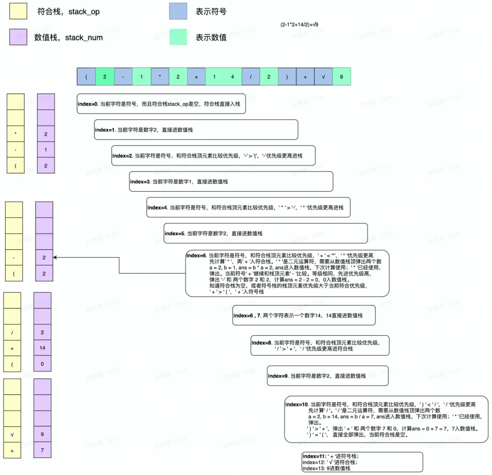
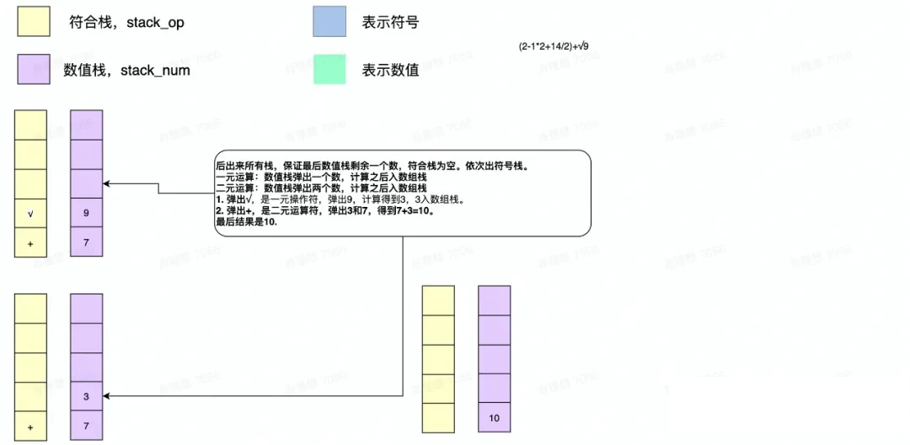

# 简易计算器

## 完整代码及测试数据

[完整代码及测试数据](https://github.com/ifwind/Algorithm-hands-on/tree/main/calculator)

## 问题简介

完成一个简易版的计算器，需要满足"+、-、*、\、√"五种算术运算，并且支持'()'算法运算。

**Example**:

| 序号 | input                      | output | 解释                                               |
| ---- | -------------------------- | ------ | -------------------------------------------------- |
| v1   | 1+1+1+1                    | 4      | 符号优先级相同，先算前面再算后面                   |
| v2   | 2-1*2                      | 0      | 先算乘除，再算加减                                 |
| v3   | (2-1)*2                    | 2      | 先算括号里面的数                                   |
| v4   | (2-1*2+14/2)+√9            | 10     | 先算括号，再算其他，开方的优先级比乘除高           |
| v5   | (2+3)*4+√9*(1/2+((1+1)*2)) | 33.5   | 同v4                                               |
| v6   | -2-3                       | -5     | 第一个'-'是表示负数，第二个'-'是运算符             |
| v7   | -2+(-3)*5                  | -17    | 第一个'-'是表示负数，括号里面的第二个'-'也表示负数 |
| v8   | √9*√9+√9                   | 12     | 开方的优先级高于乘除，乘除的优先级高于加减         |

## 解法

维护两个栈，分别是符号栈和数值栈。

1. 首先遍历字符串，进行相应的操作；
2. 遍历完字符串后，还需要进行相应的操作以清空符号栈，最后保证数值栈剩余最后一个数字为答案。

以一个例子为例进行图示，案例来自：[AlgorithmRunning - 简易计算器 (qq.com)](https://mp.weixin.qq.com/s/B9LCbfOsY0dcbXdSUYqQEQ)

1. 遍历字符串，进行相应的操作：

   

2. 清空符号栈：

   

### 处理负号

 所有的负号都可以转换成减法操作，识别出来是负号之后，在负号前补0即可。如何当前的'-'是负号，有两个条件：

1. **'-'在输入表达式的第一位(stack_num为空)**
2. **'-'之前的字符不是数字（且不能是‘）’和‘！’）**，可以想到，(-8)需要补0，但(8)-9不需要补0；

```
Input: -2-3          --->    Format_input: 0-2-3
 Input: 3+(-2)*(-1)   --->    Format_input: 3+(0-2)*(0-1)
```

### 符号之间的优先级

```python
'+': {'+':-1, '-':-1, '*':-1, '/':-1, '√':-1, '(':1, ')':-1},
'-': {'+':-1, '-':-1, '*':-1, '/':-1, '√':-1, '(':1, ')':-1},
'*': {'+': 1, '-': 1, '*':-1, '/':-1, '√':-1, '(':1, ')':-1},
'/': {'+': 1, '-': 1, '*':-1, '/':-1, '√':-1, '(':1, ')':-1},
'√': {'+': 1, '-': 1, '*': 1, '/': 1, '√':-1, '(':1, ')':-1},
'(': {'+': 1, '-': 1, '*': 1, '/': 1, '√': 1, '(':1, ')': 0},
')': {'+':-1, '-':-1, '*':-1, '/':-1, '√':-1, '(':0, ')':-1}
```

1. '+'与'+'相同，但是先入站的'+'优先级更高，-、*、/、√同理；
2. *、/的优先级比+、-更高；
3. 碰到)时，把与之匹配（的括号内的算完，所以相对其他运算符优先级更低。

### 代码

```python
class Calculator(object):
    def __init__(self):
        self.stack_op=[]
        self.stack_num=[]
        self.op_priority={  '+': {'+':-1, '-':-1, '*':-1, '/':-1, '√':-1, '(':1, ')':-1},
                            '-': {'+':-1, '-':-1, '*':-1, '/':-1, '√':-1, '(':1, ')':-1},
                            '*': {'+': 1, '-': 1, '*':-1, '/':-1, '√':-1, '(':1, ')':-1},
                            '/': {'+': 1, '-': 1, '*':-1, '/':-1, '√':-1, '(':1, ')':-1},
                            '√': {'+': 1, '-': 1, '*': 1, '/': 1, '√':-1, '(':1, ')':-1},
                            '(': {'+': 1, '-': 1, '*': 1, '/': 1, '√': 1, '(':1, ')': 0},
                            ')': {'+':-1, '-':-1, '*':-1, '/':-1, '√':-1, '(':0, ')':-1},}
        self.op_element={'+':2,'-':2,'*':2,'/':2,'√':1,'(':0,')':0}
    
    # 系统会默认调用这个函数进行评测，你必须实验这个函数
    # 输入一个计算表达式，例如2+3*√4，返回的结果是8
    # 返回计算后的结构
    def solver(self, input):
        self.stack_op.clear()
        self.stack_num.clear()
        i=0
        num=0
        last_char=''
        for i in range(len(input)):
            #注意处理大于9的数字，1 4
            print(self.stack_num,self.stack_op)
            char=input[i]
            if char.isdigit():
                num=10*num+(int(char))
            else:
                if str(last_char).isdigit():
                    self.stack_num.append(num)
                    num=0
                elif char=='-' and last_char!=')':
                    self.stack_num.append(0)
                #判断运算符的优先级
                print('---',char,self.stack_op)
                # op=char
                while self.stack_op and self.op_priority[char][self.stack_op[-1]]<=0:#优先级相同或更小
                    if self.op_priority[char][self.stack_op[-1]]<0:
                        #弹出符号，先进行处理,处理完再压栈
                        op=self.stack_op.pop()
                        if self.op_element[op]==2:#二元运算
                            a=self.stack_num.pop()
                            b=self.stack_num.pop()
                            print(str(b)+op+str(a))
                            if op=='*':self.stack_num.append(b*a)
                            elif op=='+':self.stack_num.append(b+a)
                            elif op=='-':self.stack_num.append(b-a)
                            elif op=='/':self.stack_num.append(b/a)
                        elif self.op_element[op]==1:
                            a=self.stack_num.pop()
                            if op=='√':
                                print(op+str(a))
                                self.stack_num.append(a**0.5)
                    else:
                        op=self.stack_op.pop()
                        break
                else:
                    self.stack_op.append(char)
            last_char=char
        if str(last_char).isdigit():
            self.stack_num.append(num)
        print(self.stack_num,self.stack_op)
        while self.stack_op:
            op=self.stack_op.pop()
            if self.op_element[op]==2:#二元运算
                a=self.stack_num.pop()
                b=self.stack_num.pop()
                print(str(b)+op+str(a))
                if op=='*':self.stack_num.append(b*a)
                elif op=='+':self.stack_num.append(b+a)
                elif op=='-':self.stack_num.append(b-a)
                elif op=='/':self.stack_num.append(b-a)
            elif self.op_element[op]==1:
                a=self.stack_num.pop()
                if op=='√':
                    print(op+str(a))
                    self.stack_num.append(a**0.5)
        return self.stack_num[0] 
```

## 参考资料

[AlgorithmRunning - 简易计算器 (qq.com)](https://mp.weixin.qq.com/s/B9LCbfOsY0dcbXdSUYqQEQ)

